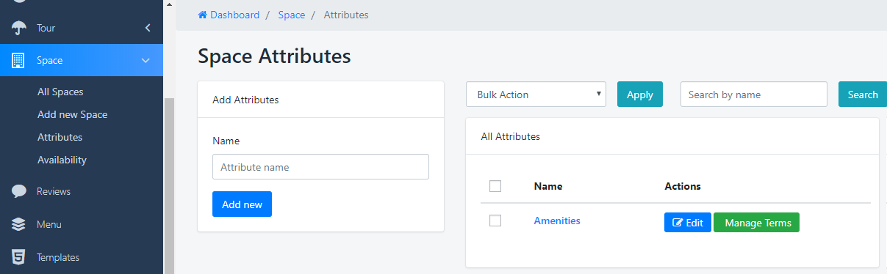
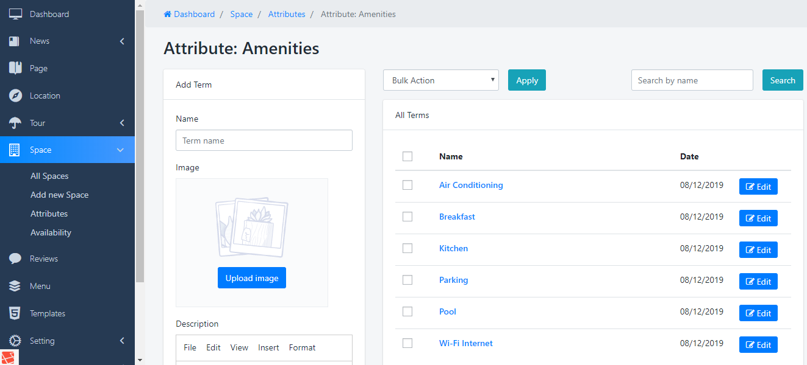

Navigate to <strong>Dashboard &gt; Space &gt; Attributes</strong> to see Panel manage. And just need to enter Name of Attributes =&gt; press to <strong>Add New</strong> button, new Attribute will be created

After creating, you have to go to Manage Term of that Attribute by Press to <strong>Manage Terms</strong> to add more Term for Attribute

